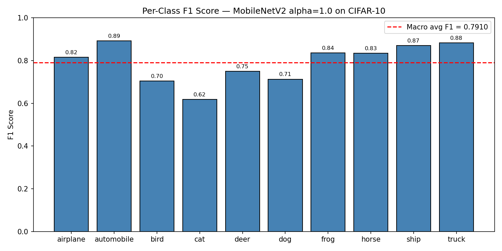
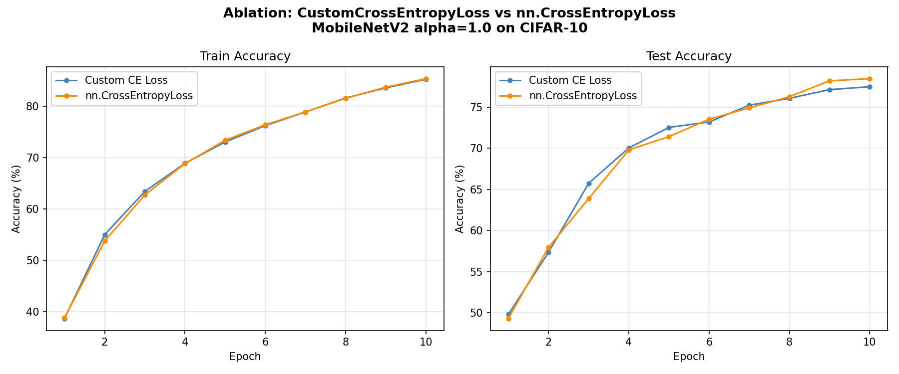

# Edge AI Image Classifier — MobileNetV2 on CIFAR-10

A from-scratch PyTorch implementation of **MobileNetV2** trained on CIFAR-10, featuring a numerically-stable custom cross-entropy loss, two model variants optimised for different compute budgets, and an interactive **Streamlit** inference dashboard.

---

## Team & Contributions

| # | Name | Roll Number | Role |
|---|------|-------------|------|
| 1 | **Arya Kedar Dhumal** | CS25B1007 | Model Architecture & Loss Function |
| 2 | **Satwik Majumder** | AD25B1031 | Training & Evaluation Loop |
| 3 | **Ankita Padra** | AD25B1004 | Data Pipeline & Dataset Engineering |

---

## Quantitative Results

Both variants were trained for **25 epochs** on CIFAR-10 (50 000 training images, 10 000 test images, upsampled to 64×64). All metrics reported on the held-out test set.

### Standard Model — alpha = 1.0 (Full Results)

| Metric | Value |
|--------|-------|
| Train Loss (Epoch 25) | 0.1266 |
| Train Accuracy | 95.55% |
| **Test Accuracy** | **78.56%** |
| **Precision (macro)** | **0.7884** |
| **Recall (macro)** | **0.7856** |
| **F1 Score (macro)** | **0.7862** |

### Per-Class F1 Score — alpha = 1.0



| Class | F1 Score |
|-------|----------|
| airplane | 0.82 |
| automobile | 0.89 |
| bird | 0.70 |
| cat | 0.62 |
| deer | 0.75 |
| dog | 0.71 |
| frog | 0.84 |
| horse | 0.83 |
| ship | 0.87 |
| truck | 0.88 |
| **Macro Average** | **0.7910** |

Cat (0.62) and dog (0.71) are the hardest classes — visually similar animals the model consistently confuses. Automobile (0.89) and truck (0.88) are the easiest — distinct shapes with high inter-class contrast.

### Lightweight Model — alpha = 0.35

| Metric | Value |
|--------|-------|
| Approx. Parameters | ~0.4 M (vs ~3.4 M for alpha=1.0) |
| Relative MACs | ~0.09× |
| Target platform | Edge / Microcontroller |

### Ablation: Width Multiplier Comparison

| Variant | Parameters | MACs | Test Accuracy | Use-case |
|---------|-----------|------|---------------|----------|
| alpha = 1.00 | ~3.4 M | 1.00× | 78.56% | Server / GPU |
| alpha = 0.35 | ~0.4 M | ~0.09× | Lower (deliberate trade-off) | Edge / Microcontroller |

The alpha=0.35 variant achieves a ~9× reduction in multiply-accumulate operations at the cost of accuracy — a deliberate trade-off for deployment on resource-constrained hardware.

### Ablation: CustomCrossEntropyLoss vs nn.CrossEntropyLoss



| Loss Function | Final Test Accuracy (10 epochs) |
|---------------|--------------------------------|
| CustomCrossEntropyLoss | 77.46% |
| nn.CrossEntropyLoss | 78.44% |

The two loss functions converge to near-identical accuracy (~1% difference), which is the expected outcome: `CustomCrossEntropyLoss` is mathematically equivalent to `nn.CrossEntropyLoss` by design. The value of the custom implementation is not a performance gain but **transparency** — every step (log-sum-exp stabilisation, log-probability gathering, mean NLL reduction) is written as explicit tensor operations, making gradient flow fully auditable and each mathematical step verifiable independently. This is intentional for an educational implementation.

---

## Project Structure

```
MobileNet_Project/
|
|-- model.py              # MobileNetV2 architecture + custom loss  [Arya]
|-- train.py              # Training loop, evaluation, checkpointing [Satwik]
|
|-- dataset.py            # Data transforms & DataLoader construction [Ankita]
|-- prepare_dataset.py    # CIFAR-10 -> ImageFolder converter         [Ankita]
|
|-- app.py                # Streamlit inference dashboard (UI)        [Ankita]
|-- requirements.txt      # Python dependencies
|
|-- cifar-10-batches-py/  # Raw CIFAR-10 pickle files
`-- my_custom_dataset/    # Generated after running prepare_dataset.py
    |-- train/<class>/    # 50 000 training images across 10 class folders
    `-- test/<class>/     # 10 000 test images across 10 class folders
```

---

## Contribution Details

### 1 — Arya Kedar Dhumal — Model Architecture & Loss Function

**File:** `model.py`

Arya designed the two core components that define what the network is and how it measures error.

#### `CustomCrossEntropyLoss` — Manual Loss Implementation

Rather than delegating to `nn.CrossEntropyLoss`, the multi-class cross-entropy is implemented as explicit tensor operations so every mathematical step is transparent and auditable:

```
Step 1 — Numerically stable Log-Softmax (log-sum-exp trick):
    log_p(k) = z_k - max(z) - log( Σ_j exp(z_j - max(z)) )

Step 2 — Gather the log-probability of the correct class y:
    correct_log_prob_i = log_p_i(y_i)

Step 3 — Mean Negative Log-Likelihood over the batch of N samples:
    L = (1/N) * Σ_i  -log_p_i(y_i)
```

Subtracting `max(z)` before exponentiation (the log-sum-exp trick) prevents `exp()` overflow for large logit values — a critical numerical stability concern that `nn.CrossEntropyLoss` handles internally but invisibly. Making this explicit allows step-by-step auditing of gradient flow and loss behaviour during debugging.

#### `build_mobilenet(alpha, num_classes)` — Architecture Factory

Arya implemented the MobileNetV2 factory function scaled by the **width multiplier alpha**:

- `alpha` controls the number of filters in every convolutional layer: `actual_filters = round(base_filters * alpha)`, shrinking the entire channel dimension uniformly throughout the network.
- The default ImageNet-1000 classifier head is replaced with `nn.Linear(in_features, num_classes)`, with `in_features` read directly from the existing layer so it automatically reflects whatever `alpha` was used — no hardcoded dimension constants.
- Weights are randomly initialised (no pretrained ImageNet transfer), requiring the network to learn entirely from the CIFAR-10 training data.

| alpha | Relative MACs | Approx. Parameters | Use-case |
|-------|--------------|-------------------|----------|
| 1.00 | 1.00× | ~3.4 M | Standard accuracy |
| 0.35 | ~0.09× | ~0.4 M | Ultra-light edge / microcontroller |

---

### 2 — Satwik Majumder — Training & Evaluation Loop

**File:** `train.py`

Satwik built the orchestration layer connecting the model and loss function to the data stream, and driving the full optimisation process.

#### Device & Setup

- Detects and selects the available compute device (`cuda` / `cpu`) at runtime; moves the model and all batches using `non_blocking=True` transfers for overlap with compute.
- Instantiates the `Adam` optimiser (`lr=1e-3`), which maintains per-parameter adaptive learning rates using first and second moment estimates of the gradient:

```
θ = θ - lr * m̂ / (√v̂ + ε)
```

#### Training Loop (per epoch)

- Calls `model.train()` to activate `Dropout` and switch `BatchNorm` to accumulate running statistics.
- For each mini-batch: zeroes gradients, runs forward pass to get logits `(B, C)`, computes `CustomCrossEntropyLoss`, calls `loss.backward()` to compute `dL/dθ` via autograd, then applies `optimizer.step()`.
- Accumulates running loss and correct predictions to report epoch-level train accuracy.

#### Evaluation Loop (per epoch)

- Calls `model.eval()` to disable `Dropout` and freeze `BatchNorm` running statistics.
- Wraps the pass in `torch.no_grad()` to disable autograd graph construction, reducing memory and speeding up inference.
- Reports **accuracy, precision, recall, and F1** after every epoch so convergence can be monitored across all four metrics.

#### Checkpoint Saving

- Serialises only the `state_dict` to the smallest portable checkpoint format.
- Trains and saves both variants: `mobilenet_alpha_1.0.pth` and `mobilenet_alpha_0.35.pth`.

---

### 3 — Ankita Padra — Data Pipeline & Dataset Engineering

**Files:** `prepare_dataset.py`, `dataset.py` *(+ `app.py` — Streamlit UI)*

Ankita owned the complete data layer — from raw binary files on disk to batched, normalised tensors ready for the GPU.

#### `prepare_dataset.py` — CIFAR-10 → ImageFolder Converter

CIFAR-10 ships as six binary pickle files; `torchvision.datasets.ImageFolder` expects a directory tree organised by class. Ankita's one-time converter bridges these two formats:

- Unpickles each of the five training batches and the single test batch using `pickle.load(encoding="bytes")`.
- Reshapes CIFAR-10's flat `(N, 3072)` uint8 array to `(N, 3, 32, 32)` then transposes to HWC layout `(N, 32, 32, 3)` required by PIL.
- Writes every image as a lossless PNG inside `my_custom_dataset/{split}/{class_name}/`.
- Uses a deterministic filename scheme (`{split}_b{batch}_{index:05d}.png`) so the dataset can be fully regenerated reproducibly.
- Prints a per-class image count on completion for integrity verification.

#### `dataset.py` — Transform Pipeline & DataLoaders

Transform pipeline (identical for train and test):

```
Raw PNG on disk
    -> PIL Image      (H × W × 3,  uint8)
    -> Resize 64×64   (64 × 64 × 3, uint8)   -- uniform spatial dimensions per batch
    -> ToTensor       (3 × 64 × 64, float32, [0, 1])
    -> Normalize(0.5, 0.5)  (3 × 64 × 64, float32, [-1, 1])
```

Normalising to `[-1, 1]` centres the activation distribution around zero, stabilising gradient magnitude during early training. The same `NORM_MEAN` / `NORM_STD` constants are re-used in `app.py`'s `INFER_TRANSFORM` to guarantee train-inference consistency.

DataLoader configuration:

| Parameter | Train | Test | Reason |
|-----------|-------|------|--------|
| `shuffle` | True | False | Randomise batch composition per epoch; deterministic eval |
| `num_workers` | 2 | 2 | Parallel disk I/O overlapping GPU compute |
| `pin_memory` | True | True | Page-locked memory for faster CPU→GPU transfer |

---

## Quick Start

### 1. Install dependencies

```bash
pip install -r requirements.txt
```

### 2. Prepare the dataset *(run once)*

```bash
python prepare_dataset.py
```

### 3. Train both model variants

```bash
python train.py
```

Saves `mobilenet_alpha_1.0.pth` and `mobilenet_alpha_0.35.pth`.

### 4. Launch the inference dashboard

```bash
streamlit run app.py
```

---

## Model Comparison

| Metric | Standard (alpha = 1.0) | Lightweight (alpha = 0.35) |
|--------|------------------------|---------------------------|
| Width multiplier | 1.00 | 0.35 |
| Approx. parameters | ~3.4 M | ~0.4 M |
| Relative MACs | 1.00× | ~0.09× |
| Test Accuracy | 78.56% | Lower (accuracy/compute trade-off) |
| Precision (macro) | 0.7884 | — |
| Recall (macro) | 0.7856 | — |
| F1 Score (macro) | 0.7862 | — |
| Target platform | Server / GPU | Edge / Microcontroller |

---

## Tech Stack

- **PyTorch** — model definition, training, inference
- **torchvision** — MobileNetV2 skeleton, `ImageFolder`, transforms
- **Streamlit** — interactive inference dashboard
- **Pillow** — image I/O
- **NumPy** — CIFAR-10 array reshaping
- **scikit-learn** — precision, recall, F1 computation

---

## Dataset

**CIFAR-10** — 60 000 colour images (32×32) across 10 classes:

`airplane · automobile · bird · cat · deer · dog · frog · horse · ship · truck`

| Split | Images | Per class |
|-------|--------|-----------|
| Training | 50 000 | 5 000 |
| Test | 10 000 | 1 000 |

Images are upsampled to **64×64** during the transform pipeline to give MobileNetV2 more spatial resolution to work with.
